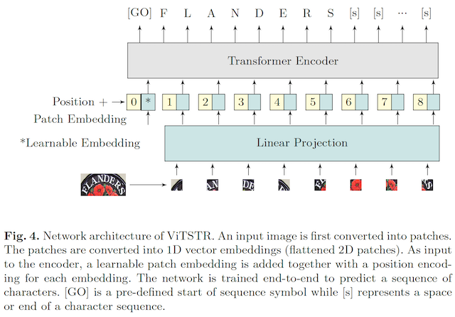

# Vision Transformer for Fast and Efficient Scene Text Recognition

ViTSTR is a simple single-stage model that uses a pre-trained Vision Transformer (ViT) to perform Scene Text Recognition (ViTSTR). It has a comparable accuracy with state-of-the-art STR models although it uses significantly less number of parameters and FLOPS. ViTSTR is also fast due to the parallel computation inherent to ViT architecture. 

### Paper
* [ICDAR 2021](https://link.springer.com/chapter/10.1007/978-3-030-86549-8_21)
* [Arxiv](https://arxiv.org/abs/2105.08582)



ViTSTR is built using a fork of [CLOVA AI Deep Text Recognition Benchmark](https://github.com/clovaai/deep-text-recognition-benchmark). Below we document how to train and evaluate ViTSTR-Tiny and ViTSTR-small.

### Install requirements

```
pip3 install -r requirements.txt
```

### Inference

```
python3 infer.py --image demo_image/demo_1.png --model https://github.com/roatienza/deep-text-recognition-benchmark/releases/download/v0.1.0/vitstr_small_patch16_jit.pt
```

Replace `--image` by the path to your target image file.

After the model has been downloaded, you can perform inference using the local checkpoint:

```
python3 infer.py --image demo_image/demo_2.jpg --model vitstr_small_patch16_jit.pt
```

**Quantized Model on x86**

```
python3 infer.py --image demo_image/demo_1.png --model  https://github.com/roatienza/deep-text-recognition-benchmark/releases/download/v0.1.0/vitstr_small_patch16_quant.pt --quantized
```

**Quantized Model on Raspberry Pi 4**

```
python3 infer.py --image demo_image/demo_1.png --model  https://github.com/roatienza/deep-text-recognition-benchmark/releases/download/v0.1.0/vitstr_small_patch16_quant.pt --quantized --rpi
```

**Inference Time on GPU using JIT**
```
python3 infer.py --model https://github.com/roatienza/deep-text-recognition-benchmark/releases/download/v0.1.0/vitstr_small_patch16_jit.pt --time --gpu
```
```
Average inference time per image: 2.57e-03 sec (Quadro RTX 6000)
Average inference time per image: 4.53e-03 sec (V100)
```

**Inference Time on CPU using JIT**
```
python3 infer.py --model https://github.com/roatienza/deep-text-recognition-benchmark/releases/download/v0.1.0/vitstr_small_patch16_jit.pt --time
```
```
Average inference time per image: 2.80e-02 sec (AMD Ryzen Threadripper 3970X 32-Core)
Average inference time per image: 2.70e-02 sec (Intel(R) Xeon(R) CPU E5-2650 v4 @ 2.20GHz)
```

**Inference Time on RPi 4**
```
python3 infer.py --model https://github.com/roatienza/deep-text-recognition-benchmark/releases/download/v0.1.0/vitstr_small_patch16_quant.pt  --time --rpi --quantized
```
```
Average inference time per image: 3.69e-01 sec (Quantized)
```
```
python3 infer.py --model https://github.com/roatienza/deep-text-recognition-benchmark/releases/download/v0.1.0/vitstr_small_patch16_jit.pt  --time --rpi
```
```
Average inference time per image: 4.64e-01 sec (JIT)
```

#### Sample Results:
| Input Image | Output Prediction  |
| :---: | :---: |
|  | `Available` |
|  | `SHAKESHACK` |
|  | `Londen` |
|  | `Greenstead` |

### Dataset

Download lmdb dataset from [CLOVA AI Deep Text Recognition Benchmark](https://github.com/clovaai/deep-text-recognition-benchmark).

### Quick validation using a pre-trained model 

ViTSTR-Small

```
CUDA_VISIBLE_DEVICES=0 python3 test.py --eval_data data_lmdb_release/evaluation \
--benchmark_all_eval --Transformation None --FeatureExtraction None \
--SequenceModeling None --Prediction None --Transformer \
--sensitive --data_filtering_off  --imgH 224 --imgW 224 \
--TransformerModel=vitstr_small_patch16_224 \ 
--saved_model https://github.com/roatienza/deep-text-recognition-benchmark/releases/download/v0.1.0/vitstr_small_patch16_224_aug.pth
```

Available model weights:

| Tiny | Small  | Base |
| :---: | :---: | :---: |
| `vitstr_tiny_patch16_224` | `vitstr_small_patch16_224` | `vitstr_base_patch16_224`|
|[ViTSTR-Tiny](https://github.com/roatienza/deep-text-recognition-benchmark/releases/download/v0.1.0/vitstr_tiny_patch16_224.pth)|[ViTSTR-Small](https://github.com/roatienza/deep-text-recognition-benchmark/releases/download/v0.1.0/vitstr_small_patch16_224.pth)|[ViTSTR-Base](https://github.com/roatienza/deep-text-recognition-benchmark/releases/download/v0.1.0/vitstr_base_patch16_224.pth)|
|[ViTSTR-Tiny+Aug](https://github.com/roatienza/deep-text-recognition-benchmark/releases/download/v0.1.0/vitstr_tiny_patch16_224_aug.pth)|[ViTSTR-Small+Aug](https://github.com/roatienza/deep-text-recognition-benchmark/releases/download/v0.1.0/vitstr_small_patch16_224_aug.pth)|[ViTSTR-Base+Aug](https://github.com/roatienza/deep-text-recognition-benchmark/releases/download/v0.1.0/vitstr_base_patch16_224_aug.pth)|


### Benchmarks (Top 1% accuracy)

| Model | IIIT | SVT | IC03 | IC03 | IC13 | IC13 | IC15 | IC15 | SVTP | CT | Acc | Std
| :--- | :---: | :---: | :---: | :---: | :--: | :--: | :---: | :---: | :---: | :---: | :---: | :--: |
|  | 3000 | 647 | 860 | 867 | 857 |1015 |1811 |2077 |645 |288 |% |  %|
| TRBA (Baseline) | 87.7	|87.4	|94.5	|94.2	|93.4	|92.1	|77.3	|71.6	|78.1	|75.5	|84.3	|0.1
| ViTSTR-Tiny | 83.7 | 83.2 | 92.8 | 92.5 | 90.8 | 89.3 | 72.0 | 66.4 | 74.5 | 65.0 | 80.3| 0.2
| ViTSTR-Tiny+Aug | 85.1	|85.0	|93.4	|93.2	|90.9	|89.7	|74.7	|68.9	|78.3	|74.2	|82.1	|0.1
| ViTSTR-Small | 85.6	|85.3	|93.9	|93.6	|91.7	|90.6	|75.3	|69.5	|78.1	|71.3	|82.6	|0.3
| ViTSTR-Small+Aug  | 86.6	|87.3	|94.2	|94.2	|92.1	|91.2	|77.9	|71.7	|81.4	|77.9	|84.2	|0.1
| ViTSTR-Base  | 86.9	|87.2	|93.8	|93.4	|92.1	|91.3	|76.8	|71.1	|80.0	|74.7	|83.7	|0.1
| ViTSTR-Base+Aug  | 88.4	|87.7	|94.7	|94.3	|93.2	|92.4	|78.5	|72.6	|81.8	|81.3	|85.2	|0.1


### Comparison with other STR models

#### Accuracy vs Number of Parameters


#### Accuracy vs Speed (2080Ti GPU)


#### Accuracy vs FLOPS


### Train

ViTSTR-Tiny without data augmentation 

```
RANDOM=$$

CUDA_VISIBLE_DEVICES=0 python3 train.py --train_data data_lmdb_release/training \
--valid_data data_lmdb_release/evaluation --select_data MJ-ST \
--batch_ratio 0.5-0.5 --Transformation None --FeatureExtraction None \ 
--SequenceModeling None --Prediction None --Transformer \
--TransformerModel=vitstr_tiny_patch16_224 --imgH 224 --imgW 224 \
--manualSeed=$RANDOM  --sensitive
```

### Multi-GPU training

ViTSTR-Small on a 4-GPU machine

It is recommended to train larger networks like ViTSTR-Small and ViTSTR-Base on a multi-GPU machine. To keep a fixed batch size at `192`, use the `--batch_size` option. Divide `192` by the number of GPUs. For example, to train ViTSTR-Small on a 4-GPU machine, this would be `--batch_size=48`.

```
python3 train.py --train_data data_lmdb_release/training \
--valid_data data_lmdb_release/evaluation --select_data MJ-ST \
--batch_ratio 0.5-0.5 --Transformation None --FeatureExtraction None \
--SequenceModeling None --Prediction None --Transformer \
--TransformerModel=vitstr_small_patch16_224 --imgH 224 --imgW 224 \
--manualSeed=$RANDOM --sensitive --batch_size=48
```

### Data augmentation 

ViTSTR-Tiny using rand augment

It is recommended to use more workers (eg from default of `4`, use `32` instead) since the data augmentation process is CPU intensive. In determining the number of workers, a simple rule of thumb to follow is it can be set to a value between 25% to 50% of the total number of CPU cores. For example, for a system with `64` CPU cores, the number of workers can be set to `32` to use 50% of all cores.  For multi-GPU systems, the number of workers must be divided by the number of GPUs. For example, for `32` workers in a 4-GPU system, `--workers=8`. For convenience, simply use `--workers=-1`, 50% of all cores will be used. Lastly, instead of using a constant learning rate, a cosine scheduler improves the performance of the model during training.

Below is a sample configuration for a 4-GPU system using batch size of `192`.

```
python3 train.py --train_data data_lmdb_release/training \
--valid_data data_lmdb_release/evaluation --select_data MJ-ST \
--batch_ratio 0.5-0.5 --Transformation None --FeatureExtraction None \
--SequenceModeling None --Prediction None --Transformer \
--TransformerModel=vitstr_tiny_patch16_224 --imgH 224 --imgW 224 \
--manualSeed=$RANDOM  --sensitive \
--batch_size=48 --isrand_aug --workers=-1 --scheduler
```


### Test

ViTSTR-Tiny. Find the path to `best_accuracy.pth` checkpoint file (usually in `saved_model` folder).

```
CUDA_VISIBLE_DEVICES=0 python3 test.py --eval_data data_lmdb_release/evaluation \
--benchmark_all_eval --Transformation None --FeatureExtraction None \
--SequenceModeling None --Prediction None --Transformer \
--TransformerModel=vitstr_tiny_patch16_224 \
--sensitive --data_filtering_off  --imgH 224 --imgW 224 \
--saved_model <path_to/best_accuracy.pth>
```


## Citation
If you find this work useful, please cite:

```
@inproceedings{atienza2021vision,
  title={Vision transformer for fast and efficient scene text recognition},
  author={Atienza, Rowel},
  booktitle={International Conference on Document Analysis and Recognition},
  pages={319--334},
  year={2021},
  organization={Springer}
}
```
